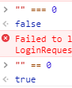

[TOC]
## 1 JS
### 1.1 JS中获取EL表达式
`var ctx = "${ctx}";`
### 1.2 清空后加入HTML
```
$('#dsampleTimeTd'+index).text("");
$('#dsampleCountTd'+index).append("&nbsp;&nbsp;样品需求数量<font color='red'>*</font>:");
```
### 1.3 删除div中内部所有的元素
清空id为X的div中的内容
`$('#X').empty();`
### 1.4 清空form表单
`$("#searchForm").form("clear");`
### 1.5 ie8不支持console.log()的解决方法
```
window.console = window.console || (function () {
    var c ={}; 
　　c.log = c.warn = c.debug = c.info = c.error = c.time = c.dir = c.profile= c.clear = c.exception = c.trace = c.assert = function(){};
    return c;
})();
```
### 1.6 判断一个控件是否存在
`$("#fm" + divID).length > 0`
### 1.7 空串和0的问题


### 1.8 Math的四舍五入和切割
Math.round():就是括号内的数+0.5之后，向下取值：-6.5–>-6;6.5–>7
Math.floor():为取地板的意思，就是取接近当前值的负向：-6.5–>-7;6.5–>6
Math.ceil():为取天花板的意思，就是取接近当前值的正向：-6.5–>-6;6.5–>7

### 1.9 JSON的时间
JSON中存在2018-09-23T15:00:00Z的情况，在new Date的时候，浏览器会根据你系统时区做修改，比如东八区会加8小时等

### 1.10 JS遍历JSON对象所有key及根据动态key获取值
```
var jsonObj={"name":"张三","age":"24","profession":"工程师"}; 
for(var item in jsonObj){ 
    if(item == key) { // item 表示Json串中的属性，如'name' 
        var jValue = jsonObj[item];// key所对应的value 
        alert(jValue); 
    } 
}        
```
### 1.11 JS简单循环遍历JSON数组的方法
```
var str = '[{"name":"宗2瓜","num":"1","price":"122"},{"name":"宗呱呱","num":"1","price":"100"}]';
var xqo = eval('(' + str + ')');
for(var i in xqo){
　　alert(xqo[i].name);
}
```
通过JQUERY解析JSON
```
var cc = jQuery.parseJSON(data);
alert(cc[0].title);
```
## 2 JQuery
### 2.1 checkbox/radio
#### 2.1.1 checkbox获取选择值
```
$("input[type=checkbox][checked]").each(function(){
    //由于复选框一般选中的是多个,所以可以循环输出 
    alert($(this).val()); 
});
$('input[name="date_type"]:checked').each(function(index,element){
	alert($(element).val());
})
```
#### 2.1.2 将checkbox选中
`$('#A').attr('checked', 'checked')`
触发事件：`$('#A').attr('checked', 'checked').change()`
#### 2.1.3 获得checkbox是否被选中，选中为true，未选中为false
`$('#A').prop('checked')`

`$("#A").is(":checked")//被选中则返回true `

`$('#A:checked').length==1//被选中则返回true `

#### 2.1.4 全选
`$('input[name="date_type"]').attr('checked', 'checked')`
#### 2.1.5 全不选
`$('input[name="date_type"]').removeAttr('checked')`
#### 2.1.6 选中所有奇数
`$('input[name="date_type"]:odd').attr('checked','checked')`
#### 2.1.7 选中所有偶数
`$('input[name="date_type"]:even').attr('checked','checked')`
#### 2.1.8 反选
```
$('#checkBtn').click(function() { 
	$('input[name="date_type"]').each(function() { 
		this.checked = !this.checked
	});
});
```
### 2.2 选择器
#### 2.2.1 获得id为table_info下的所有tr标签，class包含disabled但不包含ban的标签。
`$('#table_info tr .disabled').not('.ban')`
#### 2.2.2 选择class同时包含A和B的元素。
`$(".A.B")`
#### 2.2.3 选择包含A或者包含B的元素。
`$(".A, .B")`
#### 2.2.4 选择包含A、包含B、包含C的元素。
`$(".A").filter(".B").filter(".C")`
#### 2.2.5 选择class同时包含A、B、C的元素，此处顺序必须一致才行
`$("[class='A B C']")`
### 2.3 显示与隐藏DIV
```
$('#showBtn').click(function(){
	if ($("#container").is(":hidden")) {
		$('#container').show();
	} else {
		$('#container').hide();
	}
});

<div id="container">
CCC
</div>
<input type="button" id="showBtn">
```
### 2.4 取消空的ul标签
```
$('.dropdown-menu').each(function(){
    if(!$(this).has("li").length){
    	$(this).remove();
    }
})
```
### 2.5 children()和find()的异同
1. children及find方法都用是用来获得element的子elements的，两者都不会返回 text node，就像大多数的jQuery方法一样。 
2. children方法获得的仅仅是元素一下级的子元素，即：immediate children。 
3. find方法获得所有下级元素，即：descendants of these elements in the DOM tree 。 
4. children方法的参数selector 是可选的（optionally），用来过滤子元素，但find方法的参数selector方法是必选的。 
5. find方法事实上可以通过使用 jQuery( selector, context )来实现。即(′li.item−ii′).find(′li′)等同于(′li.item−ii′).find(′li′)等同于(‘li’, ‘li.item-ii’)。 
### 2.6 获取子元素个数
```
// 获取id=div1下的子元素的个数
$('#div1').children().length;
```
## 3 easyui
### 3.1 datagrid
#### 3.1.1 datagrid初始化不加载，后期点击按钮加载
```
function searchProList(){
	var opts = $("#dg_tools").datagrid("options");
    opts.url = "${dynamicURL}/project/createProSelectionInit!searchParamDatagrid.action";
    $('#dg_tools').datagrid('load',sy.serializeObject($("#searchForm").form()));
}
```
#### 3.1.2 datagrid不自动加载，点击按钮才加载
```
// 首先定义一个全局变量flag
var loadFlag = false;
// 然后为datagrid赋值onBeforeLoad属性
$("#dg_tools").datagrid({	
	title:'列表',
	singleSelect:true,
	fit:true,
	url:"${dynamicURL}/project/searchParamDatagrid.action",
	onBeforeLoad:function(param){
		return loadFlag;
	}
});
// 最后为按钮添加事件
function searchProList(){
	loadFlag = true;
	$('#dg_tools').datagrid('load',sy.serializeObject($("#searchForm").form()));
	loadFlag = false;
}
```
### 3.2 combobox
#### 3.2.1 combobox多选赋值
```
var group = "001,002,003"
$('#cc').combobox('setValues',group.split(","));
```
### 3.3 easyui-numberbox
#### 3.3.1 easyui-numberbox不能超过17位
easyui-numberbox如果超过了17位，会存在某些自动的处理，原因未知
如：9876543219876543会变成9876543219876544等等，都存在进位的问题
