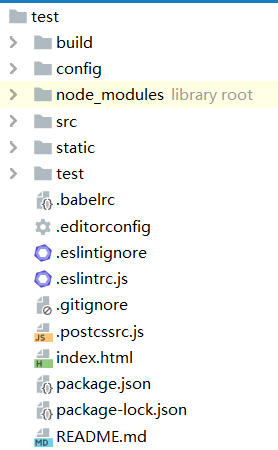
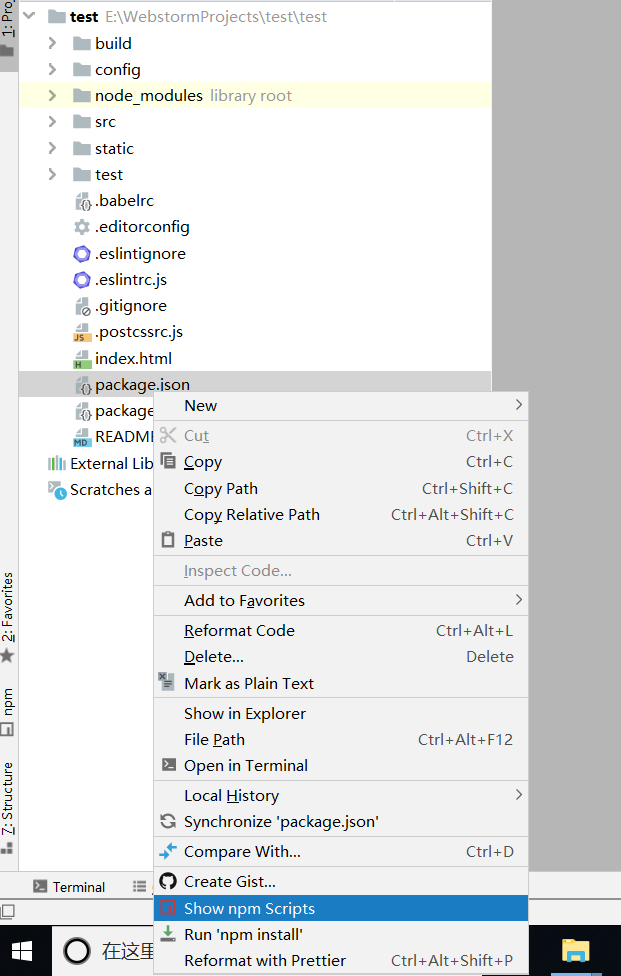
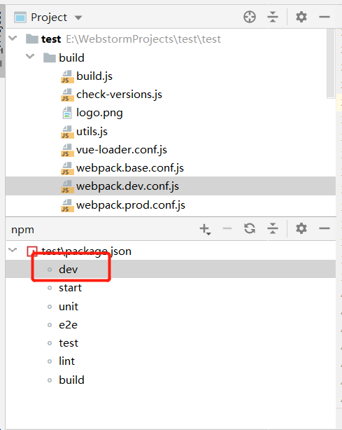
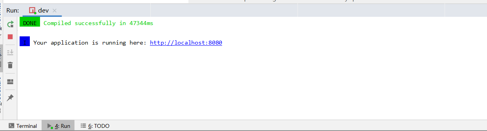
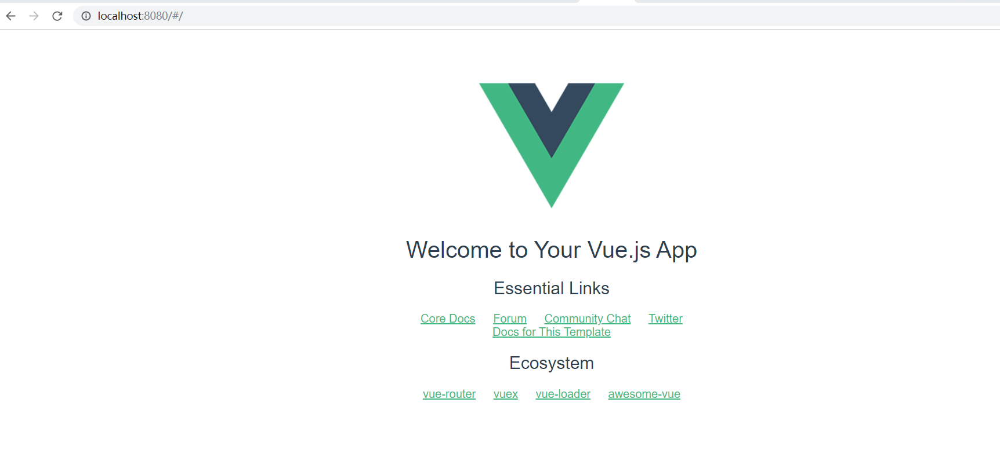

[TOC]
## 1 目录结构

|目录/文件|	说明|
|--|--|
|build|项目构建(webpack)相关代码|
|config|配置目录，包括端口号等|
|node_modules|npm 加载的项目依赖模块|
|src|开发目录|
||assets：放置一些图片，如logo等|
||components：目录里面放了一个组件文件，可以不用|
||App.vue：项目入口文件，我们也可以直接将组件写这里，而不使用 components 目录|
||main.js：项目的核心文件|
|static|静态资源目录，如图片、字体等|
|test|初始测试目录，可删除|
|.xxxx文件|这些是一些配置文件，包括语法配置，git配置等|
|index.html|首页入口文件，你可以添加一些 meta 信息或统计代码啥的|
|package.json|项目配置文件|
|README.md|项目的说明文档，markdown 格式|
## 2 实例化
每个 Vue 应用都需要通过实例化 Vue 来实现。
```
var vm = new Vue({
  el: '#vue_det',
  data: {
    alexa: "10000"
  },
  methods: {
    details: function() {
      return  this.site + " - 设置明细！";
    }
  }
})
```
el：DOM 元素中的 id
data：用于定义属性
methods：用于定义的函数，可以通过 return 来返回函数值
{{ }}：用于输出对象属性和函数返回值

## 3 运行



