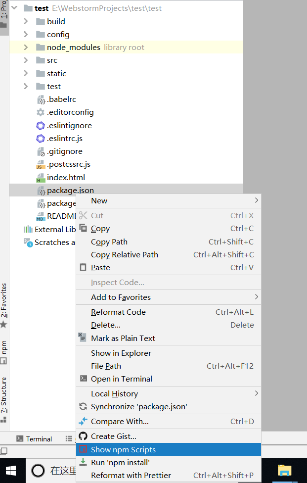
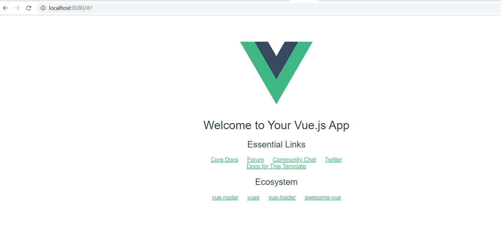

[TOC]
## 1 准备工作
### 1.1 安装node.js/Yarn
```
C:\Users\lenovo>node -v
v12.10.0
C:\Users\lenovo>npm -v
6.10.3
C:\Users\lenovo>yarn -v
yarn install v0.21.3
(node:121468) [DEP0005] DeprecationWarning: Buffer() is deprecated due to security and usability issues. Please use the Buffer.alloc(), Buffer.allocUnsafe(), or Buffer.from() methods instead.
[1/4] Resolving packages...
success Already up-to-date.
Done in 0.69s.
```
### 1.2 配置镜像
```
npm config set registry https://registry.npm.taobao.org --global
npm config set disturl https://npm.taobao.org/dist --global
yarn config set registry https://registry.npm.taobao.org --global
yarn config set disturl https://npm.taobao.org/dist --global
```
```
# 淘宝镜像安装命令
npm install -g cnpm --registry=https://registry.npm.taobao.org
# 验证命令
cnpm -v
# webPack安装命令
cnpm install webpack -g
# 验证命令
webpack -v
```
### 1.3 全局安装vue-cli
```
# 安装命令
cnpm install --global vue-cli
# 验证命令
vue -V (V要大写)
```
### 1.4 WebStorm安装与使用
详见：\项目管理\工具\web工具\WebStorm.md
## 2 创建VUE工程
### 2.1 指定模块名称和项目名称
项目名称不能有大写字母,这里我用vus_demo         
```
vue init Webpack vue_demo
```
都可以选择默认，直接回车，也可以根据自己所需依次回复Yes/no

### 2.2 安装
`cnpm install`

### 2.3 打开项目

## 3 运行



